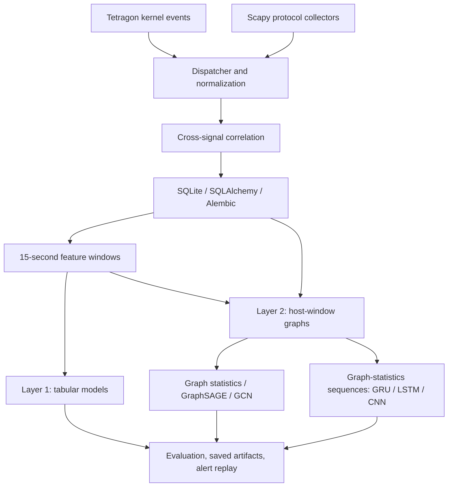

# Intelligent eBPF-Based Network Traffic Analyzer with Machine Learning-Driven Threat Detection

A Linux runtime security research project that combines Tetragon eBPF telemetry with packet metadata to detect suspicious host and network behavior. The repository delivers a Python pipeline for collection, correlation, persistence, feature engineering, model training, evaluation, and alert replay, with both tabular and graph-based detection.

Live telemetry collection is implemented. Detection is evaluated through stored observation runs and replay, continuous live model inference and automated response are not integrated into the collector.

## Key capabilities

- Collect DNS, TLS, SSH, TCP, and HTTP metadata using Scapy, including TLS JA4 fingerprints.
- Integrate Tetragon process execution/exit, network connection, listening port, sensitive file access, sudo execution, and capability-check events through custom tracing policies.
- Normalize and correlate packet and kernel signals to associate network activity with processes and enrich it with protocol, file, and privilege context.
- Persist raw observations, correlated events, run metadata, and feature windows in SQLite using SQLAlchemy, transactional repositories, and Alembic migrations.
- Extract flow, host, and process features in **15-second sliding windows with a 5-second stride**, including protocol statistics, domain entropy, JA4 rarity, process ancestry, and file/privilege activity.
- Generate labeled lab runs with MITRE ATT&CK identifiers, attack timing, tool parameters, run UUIDs, quality/status tracking, and hashed manifests, include benign scenarios that resemble attacks to examine false positives.
- Compare nine tabular algorithms through a shared model registry: LightGBM, XGBoost, Random Forest, Logistic Regression, rules, Isolation Forest, HDBSCAN, XGBOD, and residual regression.
- Build host-window graphs and train GraphSAGE/GCN models, an interpretable LightGBM graph-statistics baseline, and GRU/LSTM/CNN sequence models.
- Export datasets and manifests, save model bundles, thresholds, split information, and metrics, produce feature-importance, generalization, latency, and replay reports.

## Architecture



Layer 2 connects host, process, remote IP, domain, file, and port nodes. It includes correlated events, raw TCP flows, and time-matched raw DNS observations so inbound traffic is represented. Each node has 11 features. [baseline.py](detection/layer2/baseline.py) extracts **18 graph statistics**, including node/edge counts, density, degree, fan-out, connected components, external-IP ratio, and domain entropy. The baseline tests whether learned graph representations improve on simpler structural signals. Sequence models use past windows from the same run, the default sequence length is six (`SEQ_LENGTH`).

## Repository layout

| Path | Contents |
|---|---|
| `observation/collectors/` | Packet capture and protocol parsing |
| `observation/policies/` | Tetragon tracing policies |
| `observation/pipeline/` | Event dispatch, normalization, correlation |
| `observation/runtime/` | Collector supervision and startup/shutdown |
| `observation/database/` | Models, repositories, migrations, loading, merge utilities |
| `observation/features/` | Feature extraction, process trees, JA4 baseline |
| `observation/attack_lab/` | Attack/near-miss scripts and collection wrapper |
| `detection/` | CLI, algorithms, training, evaluation, inference, replay |
| `detection/layer2/` | Graph construction, statistics, graph and sequence models |
| `datasets/` | CSV exports, manifests, graph snapshots |
| `models/` | Saved model bundles organized by entity/model/variant |
| `experiments/reports/` | Metrics, reports, figures, comparison outputs |
| `notebooks/` | Data exploration and model experiments |
| `docs/` | Collector design, correlation, feature engineering, evaluation notes |

## Requirements and installation

Run commands from the repository root. Python **3.12** is used by the existing environment and CI. Live collection requires Linux, root privileges, and a kernel supported by your Tetragon deployment. Offline feature extraction, training, and evaluation do not require root.

```bash
python3.12 -m venv .venv
source .venv/bin/activate
python -m pip install --upgrade pip
python -m pip install --extra-index-url https://download.pytorch.org/whl/cpu -r requirements.txt
python -m pip check
```

The requirements pin `torch==2.14.0+cpu`, the extra index allows pip to locate CPU wheels. Installation also depends on pinned versions being available for your Python/platform. Use the repository's existing environment if available, there is no packaging/install entry point, so invoke modules from the root.

For complete telemetry, install and start **Tetragon** separately, make the `tetra` CLI available on the root user's `PATH`, and load the YAML policies in `observation/policies/` into that deployment. Tetragon deployment and policy-loading commands depend on whether you use standalone Linux or Kubernetes, this repository does not provision the agent. Check kernel/BTF compatibility for policy hooks. Process lifecycle events come from Tetragon's built-in event stream.

```bash
sudo tetra getevents -o json
```

Stop this diagnostic stream with Ctrl+C before starting collection. Without `tetra`, the application skips its dispatcher and continues packet collection, reducing process/file/privilege context. Install tools such as `nmap`, `hydra`, `dig`, `ssh`, or `rsync` only for the lab scripts you intend to use.

## Database paths: choose explicitly

Collection writes to `observation/database/observations.db`. Detection defaults to `observation/database/merged_observations.db`. To train directly on newly collected data, set:

```bash
export OBSERVATION_DB_PATH="$PWD/observation/database/observations.db"
python -c 'from observation.database.connection import apply_migrations, apply_migrations()'
```

Detection reads `OBSERVATION_DB_PATH`, its commands also accept `--db-path`. Feature extraction uses `--database` for a custom path. Collection uses its fixed path from `observation/paths.py`, so setting the environment variable does not redirect collection.

If you already have the merged corpus, use its path instead:

```bash
export OBSERVATION_DB_PATH="$PWD/observation/database/merged_observations.db"
```

Optional merge of separate benign and attack databases (replace input paths, use a new output file):

```bash
python -m observation.database.merge_observation_dbs \
  --benign /path/to/benign.db \
  --attack /path/to/attack.db \
  --output observation/database/merged_observations.db
```

## 1. Collect an observation run

```bash
sudo .venv/bin/python -m observation.cli.main \
  --scenario browser_light \
  --label benign \
  --notes "Browsing session for benign training data"
```

Perform the activity being measured, then press **Ctrl+C** to stop. The default shutdown runs normalization, correlation, and database loading. Record the printed `run_id`. `--no-postprocess` disables that automatic step. Collection resets working event logs at startup, run one collection session at a time.

For a benign near-miss, start collection with a descriptive scenario name and `--label benign`, then run the matching script from `observation/attack_lab/near_miss/` in another terminal using its documented arguments.

## 2. Collect labeled lab attacks (optional)

Use an isolated lab and an authorized test target. The wrapper accepts target addresses in `192.168.56.0/24` and `192.168.100.0/24`. Run it where telemetry captures the behavior being tested, if scanning an observed victim, execute the scenario remotely from the lab attacker as appropriate to your topology.

Example for a lab host at `192.168.56.10` with `nmap` installed:

```bash
sudo .venv/bin/python -m observation.attack_lab.run_attack_scenario \
  --scenario port_scan \
  --family port_scan \
  --technique T1046 \
  --tool nmap \
  --intensity low \
  --target 192.168.56.10 \
  --expected "TCP connection attempts across multiple target ports" \
  --notes "Isolated lab target" \
  --operator lab_operator \
  -- bash observation/attack_lab/scenarios/port_scan.sh 192.168.56.10 low
```

The wrapper starts collection, brackets the scenario, stops/post-processes telemetry, and records `attack:port_scan:T1046` plus metadata. Other scripts cover SSH brute force, network discovery, lateral movement over SSH, DNS tunneling, C2 beaconing, and data exfiltration. Script availability does not imply every scenario has validated detection results.

```bash
python -m observation.attack_lab.validate_manifests
```

Manifests are stored under `observation/samples/attack_runs/` and checked against the collection database.

## 3. Build and validate features

Collect multiple independent benign and attack runs before training. A single run cannot support train/validation/test evaluation.

```bash
python -m observation.features.cli --all --database "$OBSERVATION_DB_PATH"
python -m detection.cli validate --entity-type host
python -m detection.cli validate --compare
python -m detection.cli export --entity-type all
```

To rebuild individual runs, use `--run-id N` (repeatable). To omit suspect runs, add `--exclude N M` to feature extraction. `--all` selects completed runs. Feature rebuilding replaces each selected run's windows transactionally.

## 4. Train and evaluate Layer 1

```bash
python -m detection.cli train --entity-type host --model lightgbm \
  --validate --show-split --full-metrics
python -m detection.cli evaluate --entity-type host --models lightgbm
python -m detection.cli importance --entity-type host --models lightgbm
python -m detection.cli generalization --entity-type host --model lightgbm
python -m detection.cli report --entity-type host --model lightgbm --n-windows 500
```

Use `flow`, `host`, or `process` for `--entity-type`, commands supporting `all` iterate over all three. To train/rank the available tabular algorithms and promote the validation winner:

```bash
python -m detection.cli compare --entity-type host --metric pr_auc --split val --promote
```

The split groups by **run_id**, keeping overlapping windows from one run together. Test allocation accounts for label/scenario categories, categories with only one run remain training-only. Decision thresholds are selected on validation data. JA4 rarity is currently computed from the benign observation corpus before ML splitting, strict unseen-run evaluation should rebuild this baseline using training runs only.

## 5. Train and evaluate Layer 2

Build a snapshot from the same database used for Layer 1, and confirm graph construction succeeds before training:

```bash
python -m detection.cli graph-build
python -m detection.cli graph-train --baseline
python -m detection.cli graph-evaluate --baseline
python -m detection.cli graph-train --model graphsage --epochs 50
python -m detection.cli graph-evaluate --model graphsage
```

Use `--model gcn` for GCN. For temporal models, train and evaluate each model with the same command interface:

```bash
python -m detection.cli graph-train --model gru --epochs 50
python -m detection.cli graph-evaluate --model gru
```

`lstm` and `cnn` are also supported. Graph training loads a saved snapshot, changing the database path alone does not rebuild it. If graph construction fails, later commands may reuse an older snapshot.

**Current CLI issue:** `graph-compare` reads `args.seq_models`, but its parser does not define that argument. After training Layer 1 LightGBM, the graph baseline, and GraphSAGE on the same corpus, invoke the comparison function directly:

```bash
python -c 'from detection.layer2.evaluate import compare, compare()'
```

This writes overall, attack-family, and benign-scenario comparison CSVs to `experiments/reports/`. To include a trained GRU, call `compare(seq_models=("gru",))` instead.

## 6. Replay alerts

Replace `61` with a run ID present in your selected database and, for Layer 2, in the snapshot:

```bash
python -m detection.cli replay --run-id 61 --entity-type host \
  --model lightgbm --speed 5 --output /tmp/layer1_alerts.jsonl
python -m detection.cli graph-replay --run-id 61 \
  --model graphsage --speed 5 --output /tmp/layer2_alerts.jsonl
```

Replay scores stored windows, emits structured alerts, and reports timing. It is an offline demonstration of inference rather than a live deployment.

## Recorded results and limits

The [host LightGBM report from 2026-09-28](experiments/reports/report_host_lightgbm_20260928_150013.md) records held-out test **ROC-AUC 0.968**, **PR-AUC 0.862**, **precision 0.681**, and **recall 0.917**, with approximately **9.51 ms/window (105 windows/second)** in its local benchmark.

The [Layer 2 notes](docs/018-layer2-graph-detection.md) report this comparison on 3,954 test windows from 22 runs on 2026-09-29, **before the GraphSAGE pooling fix**:

| Model | Test PR-AUC | Precision | Recall | False-positive rate |
|---|---:|---:|---:|---:|
| Layer 1 LightGBM | 0.862 | 0.681 | 0.917 | 0.084 |
| Graph-statistics LightGBM | 0.952 | 0.535 | 1.000 | 0.171 |
| GraphSAGE | 0.895 | 0.602 | 0.969 | 0.126 |

These are historical lab measurements, not guarantees for the current code or another environment. The structural baseline ranked best by PR-AUC, Layer 1 produced fewer false positives. Validation coverage is limited, some scenarios have only one run, and benign backup/SSH-retry activity remains difficult. Inspect per-scenario results and unseen-family evaluation alongside aggregate scores. Rebuild snapshots and retrain to assess the current pooling and sequence implementations, no sequence performance claim is made here.

## Tests and help

```bash
python -m pytest -q
python -m pytest -q -m "not integration"
python -m pytest -q detection/tests/unit/test_layer2_builder.py detection/tests/unit/test_layer2_sequence.py
python -m detection.cli --help
python -m observation.cli.main --help
python -m observation.features.cli --help
```

Tests cover observation processing, persistence/migrations, labels, splitting, artifacts, inference, graph construction, sequences, and a Layer 1 train/evaluate round trip. The current GitHub Actions workflow runs the observation tests and migration checks, run the full command locally to include detection tests.

For design details, see [runtime tool selection](docs/001-runtime-security-tool-selection.md), [cross-signal correlation](docs/010-cross-signal-correlation.md), [feature engineering](docs/011-feature-engineering-v1.md), [attack lab](docs/013-attack-scenario-lab.md), [persistence](docs/014-sqlalchemy-persistence.md), [Layer 1 validation](docs/017-layer1-validation-and-model-selection.md), and [Layer 2 design](docs/018-layer2-graph-detection.md). Earlier design notes may describe older implementations, the commands above follow the current source.

